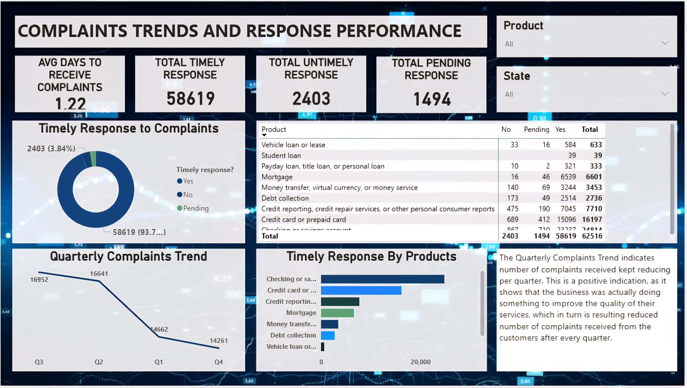

# Bank of America Consumer Complaint - Customer complaints dashboard 
---
## Project overview 
This project analyzes synthetic financial transaction and customer data modelling after Bank of America Consumer Complaint to uncover trends, improve decision-making, identify operational inefficiencies, and provide data-driven recommendations.

The data was cleaned with excel and explored with Power Bi.
The dashboard was built with Power BI and focused on uncovering insight to improve cosumer satisfaction.

## Business Questions 
The project analysis was guided by the following questions:
- which product/service category received the most complaints.
- Which category of customers are dissatisfied the most.
- What is the complaints trend over time.

## Dataset Information

| Attribute | Details |
|---|---|
| Source | Consumer Financial Protection Bureau (CFPB) |
| Industry | Financial Services |
| Dataset Type | Consumer Complaints |
| Records | 62,516 |
| Time Period | 2017 - 2023 |
| Format | XLXS |
| Dashboard pages | 2|

## key content of the dataset

| Feild | Description|
|---|---|
| Complaint ID | The unique identification number for a complaint	|
| Submitted via | How the complaint was submitted to the CFPB |
| Date submitted | The date the CFPB received the complaint |
|Date received	| The date the CFPB sent the complaint to the company |
| State |	Consumer's mailing state. |		
| Product	| Financial product associated with the complaint. |		
| Sub-product |	More detailed product classification. |
| Issue |	Primary complaint issue. |
| Sub-issue |	More detailed product classification.|
| Company public response	| Optional public response published by the company. For example, ""Company believes complaint is the result of an isolated error."" |
| Company response to consumer |Final company resolution. For example, ""Closed with explanation."" |	
| Timely response? | Indicates whether the complaint was handled within the required timeframe. (Yes/No) |

## Tools Used 

| Tool | Purpose |
|---|---|
| **Microsoft Excel** | **Data Cleaning, Validation and exploration** |
| **DAX** | **Custom measures** |
| **Power BI** | **Dashboard Development and Data visualization** |
| **Power Query** | **Data cleaning and transformation** |

---

## Methodology
1. **Data Cleaning**
   - Handled missing values.
   - Standardized date formats.
   - Corrected inconsistent categorical values.
   - Prepared the data model for Power BI.
2. **Visualization**
   - Designed two interactive dashboard using filter.

---

## Dashboard Pages
### Page 1 — Customer Complaints Overview & Distribution

### Business Insights
Customer complaints are heavily concentrated in a few states, with California (13,709), Florida (6,488), and Texas (4,686) accounting for the largest share of the 62,516 complaints. Checking & Savings Accounts (24,814 complaints), Credit Card/Prepaid Card (16,197), and Credit Reporting (7,710) are the most reported product categories. Most customers (72.66%) submitted complaints through the web, followed by referrals (17.22%), highlighting a strong preference for digital channels. Although the organization achieved an impressive 93.77% timely response rate, recurring issues related to account management and incorrect information indicate persistent operational challenges that continue to drive customer complaints.
### Business Impact
The findings suggest that customer service improvement efforts should be prioritized in high-complaint states and focused on the most affected product categories to maximize impact. Expanding digital support channels, including self-service platforms and chatbots, can further enhance the customer experience by aligning with preferred communication methods. While maintaining the current high response rate is important, addressing the root causes of recurring complaints through process improvements, better customer education, and stronger operational controls will provide greater long-term benefits by reducing complaint volumes and improving overall customer satisfaction.

### Dashboard Page 2 — Complaint Trends & Response Performance

### Business Insights
The organization demonstrated strong complaint management performance, resolving 58,619 (93.7%) complaints on time with an average response time of 1.22 days. However, 2,403 late responses and 1,494 pending complaints highlight opportunities to improve service timeliness. Credit Card/Prepaid Card services generated the highest complaint volume, while Mortgage services maintained high complaint volumes with consistently strong response performance. Complaint volumes also declined over the year, suggesting improvements in service quality, and lower-complaint products such as vehicle and student loans provide examples of effective practices that could be adopted across higher-volume product lines.
### Business Impact
Maintaining the current response efficiency while reducing late and pending complaints will strengthen customer satisfaction and regulatory compliance. Improvement efforts should prioritize Credit Card, Checking & Savings, and Credit Reporting services, while leveraging the successful complaint-handling processes used in Mortgage, vehicle loan, and student loan products. Sustaining the downward trend in complaint volumes through continuous process improvements and applying best practices across product lines can further enhance operational performance and customer experience.

---

## Recommendation
- Prioritize process improvements for Credit Card, Checking & Savings, and Credit Reporting services while strengthening root-cause analysis to reduce recurring complaints.
- Implement SLA monitoring and resolve the 1,494 pending complaints to improve response timeliness, customer satisfaction, and regulatory compliance.
- Sustain the downward trend in complaint volumes by continuously monitoring response performance and replicating best practices from high-performing product lines.

---

## Skill demonstration 
- Data cleaning
- Data Exploration
- Data modeling
- Data validation
- Data visualization and story telling.

---

# Author
**Anuoluwa Onabajo**
---
Data Analyst | Financial Analyst| Business Intelligence Analyst | Solar Engineer
Skills: Excel • SQL • Power BI • Data Visualization • Business Intelligence.
[LinkedIn](https://www.linkedin.com/in/anuoluwa-onabajo-87a429395?utm_source=share_via&utm_content=profile&utm_medium=member_android)
